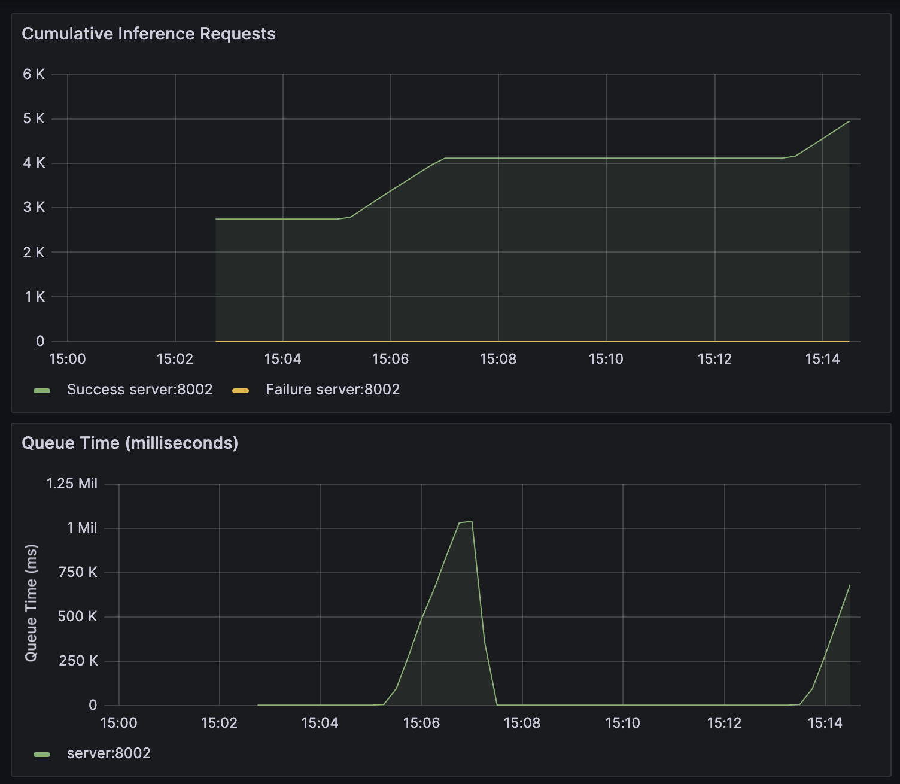

# wav2vec2-triton

The purpose of repository is to export `wav2vec2` of huggingface into **ONNX** and serve via **TritonInferenceServer**. The reference model of `wav2vec2` is 
[kresnik/wav2vec2-large-xlsr-korean](https://huggingface.co/kresnik/wav2vec2-large-xlsr-korean) model which is trained korean syllables.

## ONNX model export

- **Env. setup**
    ```
    docker compose --profile export up -d --build
    ```

- **Model Export**

    FP32 version is default. Sepcify `--fp16` parameter to export FP16 version. Expected processing time is around 3 min.
    ```
    docker exec wav2vec2-triton-export-1 python run.py [--fp16]
    ```

## TritonInferenceServer

- **Env setup**

    ```
    docker compose --profile server --profile client up -d --build
    ```
- **Inference test**
    ```
    docker exec wav2vec2-triton-client-1 python inference.py -i test_audio.wav [--fp16]
    ```

## Monitoring
I utilized **Prometheus & Grafana** to visualize statistics of **Triton**
```bash
docker compose --profile monitor up -d --build
```
### Pre requirements
Please setup [Triton Grafana Dashboard](https://grafana.com/grafana/dashboards/12832-triton-inference-server/). 
You can enter Grafana Dashboard via `3000` port.



## Benchmarking
For benchmarking, I used korean open source dataset, [zeroth dataset](https://www.openslr.org/40/), to verify performance of **ONNX+Triton** combination. What I used spec of hardware is like following.
- GPU: GTX 1080
- RAM: 16GB
- Ubuntu: 22.04
- Nvidia-Docker (GPU available)
- Nvidia driver version: 535.154.05

### How to benchmark
**[!]** It will takes extra time for fetching datasets.
- **Huggingface**

    Even the progress bar isn't update in real time, it is on processing. Please wait until process is finished :)

    Expected processing time is around 3 min.
    ```bash
    docker exec -it wav2vec2-triton-export-1 python benchmark.py # huggingface benchmark
    ```
- **Triton** 

    Model warm-up can be affect to benchmark performance. Please run benchmark at least twice times.
    ```bash
    docker exec -it wav2vec2-triton-client-1 python benchmark.py [--fp16] # triton benchmark
    ```

### Result
- dataset: `zeroth` clean testset
- Total audio length: 4287 sec

||huggingface|ONNX(FP32)+Triton|ONNX(FP16)+Triton
|:---|:---:|:---:|:---:|
|WER (%)|4.74|4.73|4.70|
|CER (%)|1.78|1.78|1.77|
|proc time (sec)|49.96|41.53|35.98|
|RTF|0.0115|0.0097|0.0084|
|GPU (MiB)|3916|3286|1744|

